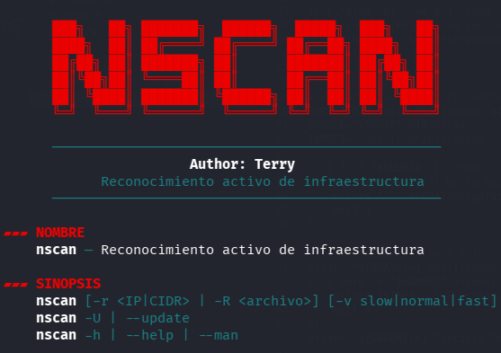
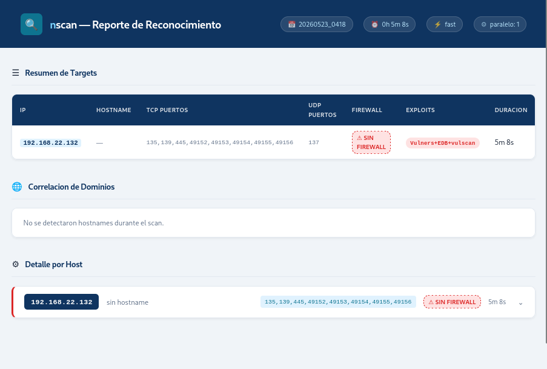

<h1 align="center">⚡ nscan</h1>

<p align="center">
  <b>Pipeline automatizado de reconocimiento activo de infraestructura</b><br>
  <i>Rápido, autónomo, sin API keys.</i>
</p>

<p align="center">
  
  
  
  
</p>

<p align="center">
  
</p>

---

## ✨ Por qué nscan

- ⚡ **Rápido pero confiable** — `nmap -sS -p-` con `--min-rate` ajustable por velocidad (`slow` / `normal` / `fast`)
- 🛡️ **Bypass automático de firewall** — `--source-port 53/80` + fragmentación sobre puertos filtered
- 🎯 **NSE autónomo** — categorías nativas (`vuln or safe or discovery`), sin mapeo manual por servicio
- 💀 **Exploit Intelligence multi-fuente** — Vulners + ExploitDB + vulscan (CVE / MITRE / SecurityFocus / OSVDB)
- 🌐 **CIDR sweep inteligente** — excluye red, broadcast, self y gateways automáticamente
- 🚀 **Paralelismo nativo** — N hosts simultáneos con sliding window (`-p N`)
- 📊 **Reporte HTML consolidado** — dark-on-light, CSS embebido, cero dependencias externas
- 🔓 **Zero API keys** — todo gratis, offline cuando es posible
- 🔬 **Trazabilidad total** — flag `-c` imprime cada comando antes de ejecutarlo
- 🖥️ **UX terminal pulido** — banner fijo, cuadros alineados, paleta dark hacker

---

## 📸 Reporte HTML

<p align="center">
  
  <br>
  <i>Reporte HTML consolidado generado al finalizar todos los targets</i>
</p>

---

## 🎯 Alcance

**✅ Sí hace — reconocimiento de infraestructura:**
- TCP discovery completo (65535 puertos vía SYN scan)
- Bypass de firewall sobre puertos `filtered`
- Detección de servicios, versiones y OS fingerprint
- NSE autónomo por categorías
- UDP discovery en dos fases (rápido + validación)
- Exploit Intelligence (Vulners + ExploitDB + vulscan)
- CIDR sweep con exclusiones automáticas
- Reporte HTML consolidado

**❌ No hace — pentesting web:**
- Sin `gobuster`, `nikto`, `wpscan`, `feroxbuster`, fuzzing de directorios
- Para 80/443 sólo corren scripts de infraestructura (`ssl-cert`, `http-title`, `http-headers`)

---

## 🚀 Instalación

```bash
git clone https://github.com/Terry-wl/nscan.git
cd nscan
sudo ./install.sh
```

El instalador copia `nscan` a `/usr/local/bin/nscan` (requiere `sudo` porque ese directorio es propiedad de root) y le da permisos de ejecución.

**Primera ejecución** (`sudo nscan -r <ip>`) instala automáticamente las dependencias:
- `nmap` (obligatorio)
- `bind9-dnsutils` · `traceroute` · `exploitdb` · `jq` · `git`
- `vulscan` (clonado a `/usr/share/nmap/scripts/vulscan/`)

El marcador `/var/lib/nscan/.initialized` evita reinstalación.

---

## 🛠️ Uso

```
nscan -r <IP|CIDR|hostname> [-v slow|normal|fast] [-p N] [-F] [-c]
nscan -R <archivo>          [-v slow|normal|fast] [-p N] [-c]
nscan -U | --update
nscan -h | --help | --man
```

### Opciones

| Flag | Descripción |
|---|---|
| `-r <target>` | Objetivo único. IP, hostname o CIDR (cualquier máscara `/8` … `/30`) |
| `-R <archivo>` | Lista de objetivos, uno por línea. Líneas con `#` se ignoran |
| `-v slow\|normal\|fast` | Velocidad de escaneo. Default: `normal` |
| `-p N` | Lanza N pipelines de host en paralelo. Default: 1 |
| `-F` | Full pipeline tras CIDR discovery (combinar con `-r CIDR -F`) |
| `-c`, `--show-cmds` | 🔬 Imprime en consola cada comando nmap/searchsploit antes de ejecutarlo |
| `-U`, `--update` | Actualiza paquetes apt y bases de datos CVE |
| `-h`, `--help`, `--man` | Muestra el manual completo |

> 💡 Al ejecutar `sudo nscan` sin argumentos sólo verás el banner y un recordatorio para usar `--help` / `--man`. El manual completo aparece sólo con esas flags.

### Velocidades (`-v`)

| Modo | `nmap --min-rate` | `nmap -T` | Uso |
|---|---|---|---|
| 🐢 `slow` | 100 | `-T2` (+ `--scan-delay 1s`) | Auditoría real, IDS/IPS activo |
| 🚶 `normal` | 1000 | `-T3` | Default — balance velocidad/sigilo |
| 🏎️ `fast` | 5000 | `-T4` | CTF, laboratorios sin monitoreo |

### Ejemplos

```bash
# 🎯 Scan básico, velocidad normal
sudo nscan -r 10.10.10.5

# 🏎️ CTF — máxima velocidad y mostrar comandos en consola
sudo nscan -r 10.10.10.5 -v fast -c

# 🥷 Engagement real — modo sigilo
sudo nscan -r 192.168.1.5 -v slow

# 📋 Múltiples targets desde archivo, en paralelo
sudo nscan -R targets.txt -v normal -p 3

# 🌐 Descubrimiento de red /24 (sólo lista de hosts vivos)
sudo nscan -r 10.10.10.0/24

# 🔥 Descubrimiento + pipeline completo en paralelo
sudo nscan -r 10.10.10.0/24 -F -p 3 -v fast

# 🔄 Actualizar bases de datos
sudo nscan -U
```

---

## 🔁 Pipeline

```
MODO CIDR (antes del sweep)
  ├─ Exclusiones automáticas: red, broadcast, self, gateway(s)
  ├─ Fase N1 — Host discovery (nmap -sn multi-probe: -PE -PS -PA -PU -PR)
  └─ Fase N2 — Quick port survey sobre hosts vivos (top-100 + OS guess)

MODO HOST (por cada IP)
  ├─ Fase 0  — Pre-scan: ping, traceroute, DNS reversa, sonda firewall
  ├─ Fase 1a — TCP discovery (nmap -sS -p- los 65535 puertos)
  ├─ Fase 1b — Validación TCP Connect (-sT)
  ├─ Fase 1c — Bypass para filtered: --source-port 53 → 80 → fragmentación
  ├─ Fase 2  — Servicios + OS + NSE autónomo por categorías
  ├─ Fase 2b — Exploit Intelligence: Vulners + ExploitDB + vulscan
  └─ Fase 3  — UDP en dos fases (discovery + validación + NSE)

FINAL (después de TODOS los hosts)
  └─ reporte_<TIMESTAMP>.html (consolidado, sin dependencias externas)
```

---

## 📂 Estructura de salida

```
./
├── reporte_<TS>.html                      ← reporte consolidado
├── targets_vivos_<net>.txt                ← solo modo CIDR
└── <IP>/
    ├── traceroute_<TS>.txt
    └── nmap/
        ├── discovery_<TS>_sS              ← SYN scan completo
        ├── discovery_<TS>_sT              ← validación TCP Connect
        ├── discovery_<TS>_bypass{53,80,f} ← intentos de bypass
        ├── targeted_<TS>.txt              ← servicios + NSE (legible)
        ├── targeted_<TS>.xml              ← formato XML (para searchsploit)
        ├── exploit_intel_<TS>.txt         ← Vulners + EDB + vulscan unificado
        ├── exploit_sources_<TS>.txt       ← fuentes activas
        ├── sU_discovery_<TS>              ← UDP candidatos
        ├── sU_discovery_validated_<TS>    ← UDP confirmados
        └── sU_targeted_<TS>.txt           ← servicios + NSE UDP
```

Los timestamps permiten múltiples scans del mismo target sin sobrescribir.

---

## ✅ Requisitos

- 🐧 **OS:** Kali Linux (o Debian-based con `apt`). Probado en Kali 2024+
- 🔑 **Root:** obligatorio (raw sockets para `nmap -sS`)
- 🐍 **Python 3:** para cálculo de CIDR (`ipaddress`). Preinstalado en Kali
- 🐚 **Bash 4.3+:** para `wait -n` (paralelismo con ventana deslizante)

> Pensado para flujos de red team de infraestructura.
